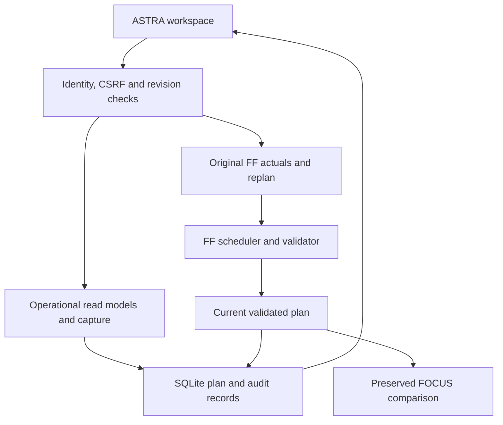

# Application architecture

The primary WSGI factory is `astra_focus.app.create_app`. It constructs the original `ff.web.app` application and installs an additive operational API, frontend, persistent record store, and security boundary.

## Integration boundaries

- The private submodule preserves original source identity and all inherited source files. No original source file is patched.
- FF remains responsible for task state, scheduling, CPM, constraint checking, economics, factor scoring, disruption policy and derived game events.
- ASTRA stores plan records, immutable shift-baseline references, planning roster settings, handover notes, write-audit records and idempotency receipts in SQLite with WAL and foreign keys enabled.
- Original FF actuals, commitments, excusals, envelopes and game-event files are routed to `ASTRA_STATE_DIR` through the existing environment seams.
- A shared in-process lock prevents API readers observing a half-built schedule and prevents actuals/roster writes racing a replan. Busy requests receive an explicit 409.
- The WSGI lock and Gunicorn guard require one engine process. Multiple independent volumes/instances are not a shared system and are unsupported.

## Identity

All application requests pass a common session boundary. Production login uses a server account file; the account's role and scope are reapplied from that file on every request. Client-supplied roles and scopes do not override it. CSRF tokens and same-origin validation protect writes. Cookies are HttpOnly, SameSite=Lax, and Secure outside explicit demo mode.

The legacy comparison is limited to director and executive identities because its inherited read models expose full-fleet data. Its fixed read bridge calls the existing FF API functions with the **current user session**, replacing the shared `director/all` service-login transport. Legacy mutations return a named `legacy_read_only` response. Operational writes are made in ASTRA.

## Performance semantics

A manager pins a specific plan version for `(team, day, shift)` once. That baseline is immutable. The source plan includes assignments, source states, CPM and original `score_task` values. Replanning creates a child plan and never changes the pinned baseline.

The performance report:

1. Reads the pinned assignment slice.
2. Uses the original FF excusal classification against the retained plan with current observed states.
3. Uses the already-computed original task values; it contains no replacement factor formula.
4. Credits tasks recorded done in that execution day/shift, after the baseline plan, and still currently done.
5. Shows excused value, moved work, and earned standard crew-hours separately.

These are explicitly labeled pinned operational performance metrics. The inherited GAMES/scorecard views continue to have their original semantics and data-feed requirements; this change does not claim a wholesale rewrite of the proposed plan-delta roadmap or a repair of all inherited game-event behavior.

## Review findings addressed or bounded

| Reference finding | Integration behavior |
|---|---|
| WEB_DASHBOARDS-02, shared director identity | Current-user calls; full-fleet comparison restricted; production persona selector disabled |
| GAMES-01, completed work disappears after replan | New pinned report retains original assignment slice and recorded completion credit |
| DATA_DEPLOY-03, unsafe multi-process state | One worker, one state-directory process lock, serialized state access |
| DATA_DEPLOY-06, memory-only audit | Persistent intent and completion records associated with authenticated user identity |
| DATA_DEPLOY-08, store-path configuration | FF environment seams route state files into an explicit persistent directory |

The original actuals JSON file and new audit database are distinct durable stores. An intent is persisted before the original write and a completion receipt afterward. They are not one distributed transaction: process/disk failure between those writes can leave an intent without a receipt. Reconcile those records against actuals before treating the history as a payroll, regulatory or financial ledger. The repository does not claim enterprise audit certification.

## Inherited limits

FF_app is the executable baseline. It is not feature-equivalent to every constraint or experimental path in MAX_FOCUS_1. Its present domain does not add new explicit zone-capacity, tooling, stay-out, or station-pulse resource models; those require reviewed domain and validator extensions. Existing task data, predecessor graphs, crew qualification and release rules remain authoritative. The original 293 tests and benchmark suite are retained unchanged.
